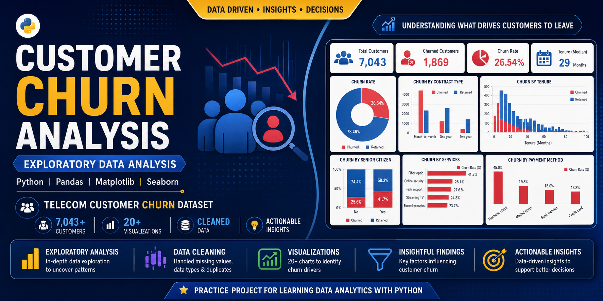
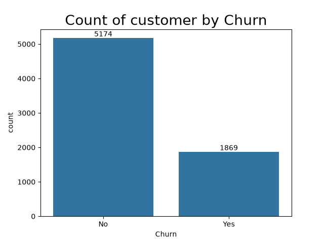
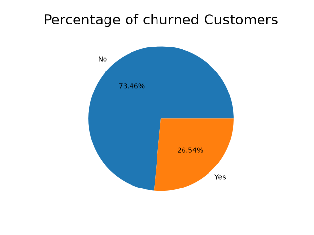
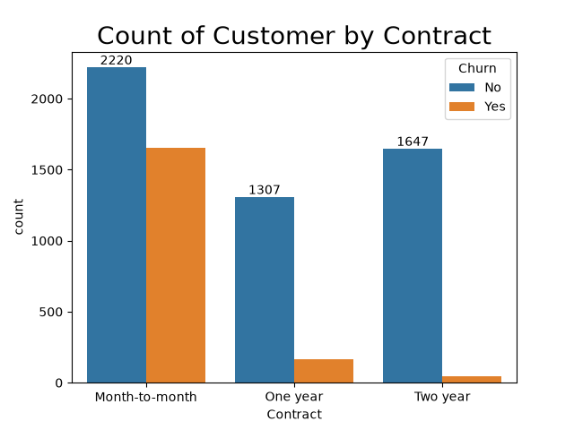
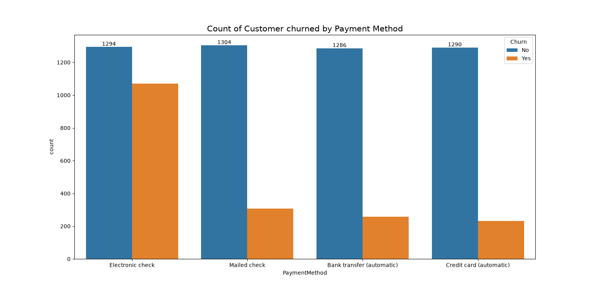

#  Telecom-Customer-Churn-Analysis-Python

## Project Overview

This project is an exploratory data analysis of a telecom customer churn dataset, done using Python (Pandas, Matplotlib, Seaborn). I built it while learning data analytics, mainly to get comfortable with EDA, cleaning messy data, and pulling out insights that would actually matter to a business — not just running charts for the sake of it.

The goal was to figure out which customers are more likely to churn and why, based on things like contract type, tenure, and payment method.
---

# Technologies Used

- Python
- Pandas
- Matplotlib
- Seaborn

---

# Dataset

**Dataset:** Telecom Customer Churn Dataset

The dataset contains information about customers such as:

- Customer Demographics
- Senior Citizen Status
- Tenure
- Contract Type
- Internet Service
- Phone Service
- Online Services
- Payment Method
- Monthly Charges
- Total Charges
- Customer Churn

---

# Project Workflow

### What I did

**Cleaning:** 
Handled blank values in TotalCharges (converted it to a proper float column), checked for missing values and duplicates.

**Transformation:**
Recoded SeniorCitizen from 0/1 to Yes/No for readability, and did a few other tweaks to make the data easier to work with.

**EDA:**
Used countplots, pie charts, histograms, crosstabs, groupby operations, and stacked bar charts to look at churn from different angles — by contract type, payment method, tenure, internet service, etc.

---

# Visualizations

### Customer Churn Count

---
### Customer Churn Percentage

---
### Churn by Contract Type

---

### Churn by Payment Method

--- 

# Key Insights

- Approximately **26.54%** of customers have churned.
- Gender has minimal impact on customer churn.
- Senior citizens have a comparatively higher churn rate.
- Customers with **Month-to-Month contracts** and **Shorter Tenure** are more likely to churn.
- Fiber Optic service users show a higher churn rate.
- Electronic Check is one of the most common payment methods among churned customers.

---

# Learning Note

This was a self-driven learning project — I used tutorials and a few YouTube videos to pick up techniques along the way, then applied them here on my own to get hands-on practice with the full EDA workflow.

---

# Author

**Dharmik Shah**

Aspiring Data Analyst | Python | SQL | Power BI

🔗 LinkedIn:
https://www.linkedin.com/in/dharmik-shah-dataanalyst/
---

